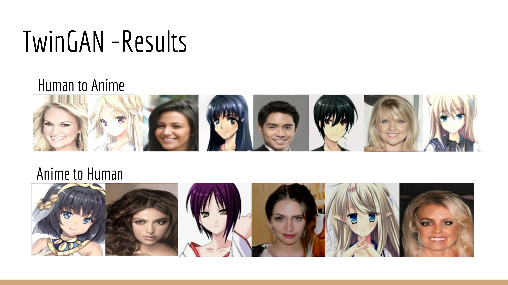
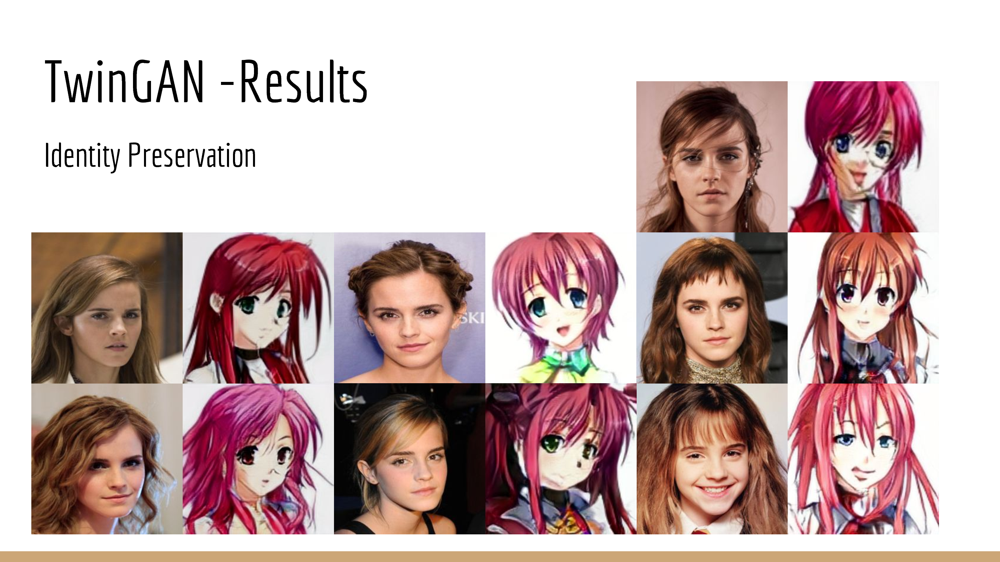
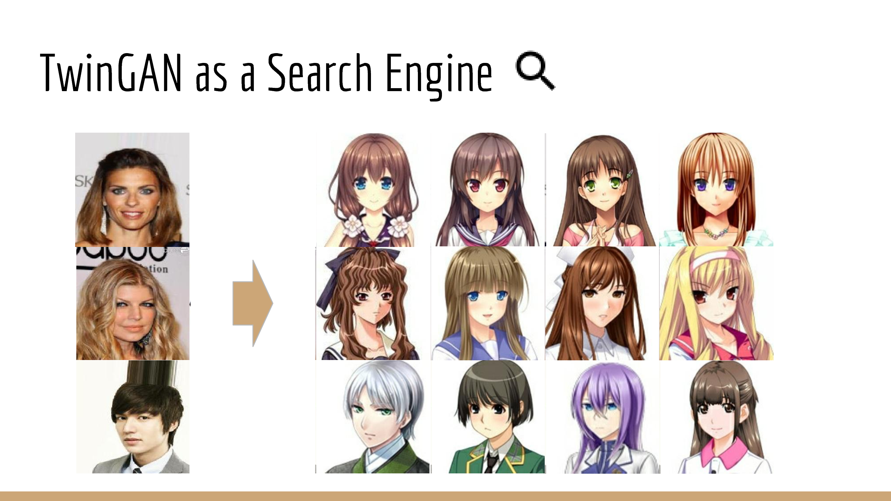
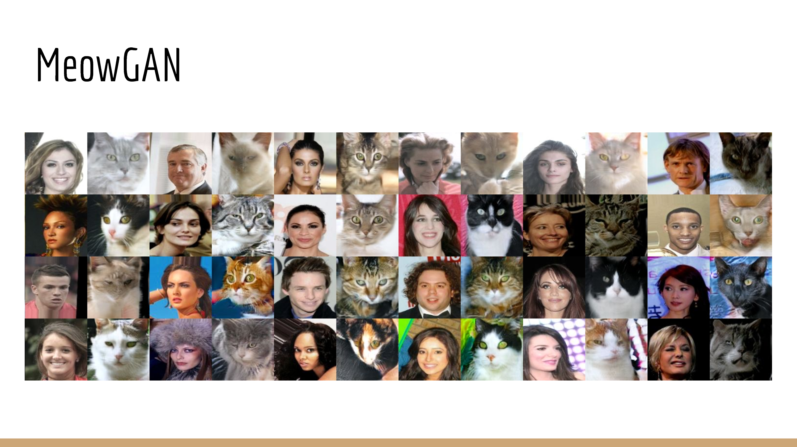

# TwinGAN -- Unsupervised Image Translation for Human Portraits






Extra materials:

[Presentation Slides at Anime Expo 2018](https://docs.google.com/presentation/d/1PWYFDYKzwiyK4ajBHl9N7GIS_WQ-SSIjCh50YRLqgNM/edit?usp=sharing)

Technical report coming soon!

## Use Pretrained Model.

For a pretrained model, you can download it [here](https://drive.google.com/open?id=1dXfqAODQxB2uNhyQANtZICAjwhNMWnbl):

Run the following command to translate the demo inputs.

```
python inference/image_translation_infer.py \
--model_path="/PATH/TO/MODEL/256/"
--image_hw=256
--input_tensor_name="sources_ph"
--output_tensor_name="custom_generated_t_style_source:0"
--input_image_path="./demo/inference_input/"
--output_image_path="./demo/inference_output/"
```

The `input_image_path` can be either one single image or a path containing images.

## Training

Download CelebA and the Getchu dataset by following the [datasets guide](docs/datasets.md). Then train your model using script from the [training guide](docs/training.md).

## Technical report.

Please refer to the [blog](docs/blog/blog_EN.md) at the moment. A more technical report will be shared soon!

## Related works

Our idea of using adaptive normalization parameters for image translation is not unique. To the best of our knowledge, at least two more work have similar ideas: [MUNIT](https://arxiv.org/abs/1804.04732) and [EG-UNIT](https://arxiv.org/abs/1805.11145). Our model is developed around the same time period with these models. 

Some key differences between our model and the two mentioned are -- we find UNet to be extremely helpful in maintaining semantic correspondence across domain, and we found that tying all convolution filter weights speeds up training while maintaining the same output quality.


## Reference

A lot of the code are adapted from online. Here is a non-exhaustive list of the repos where I borrowed code from extensively.

[TF-Slim image models library](https://github.com/tensorflow/models/tree/master/research/slim)

[PGGAN](https://github.com/tkarras/progressive_growing_of_gans/)

## Disclaimer

This personal project is developed and open sourced when I am working for Google, therefore you see Copyright 2018 Google LLC in each file. This is not an officially supported Google product. See [License](LICENSE) and [Contributing](CONTRIBUTING.md) for more details.
