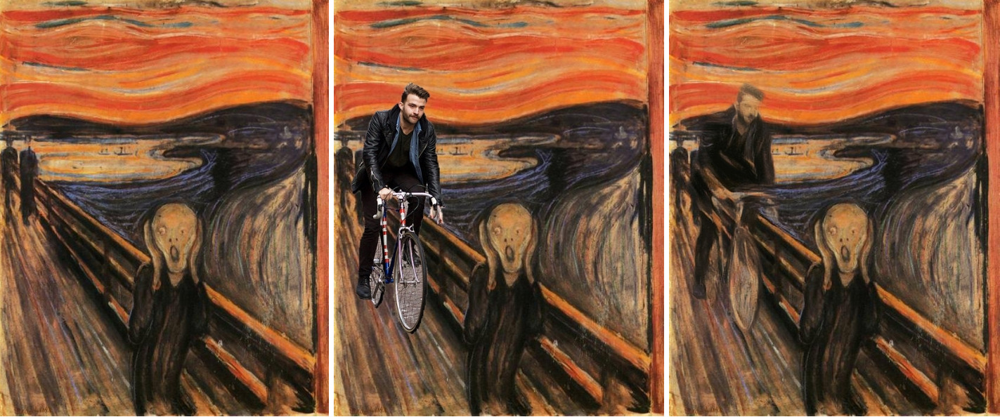
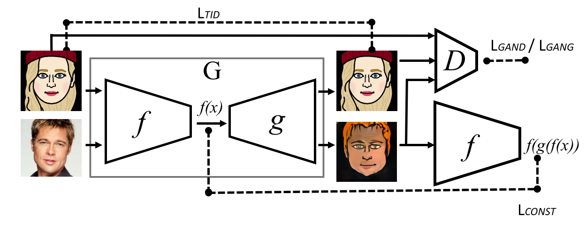
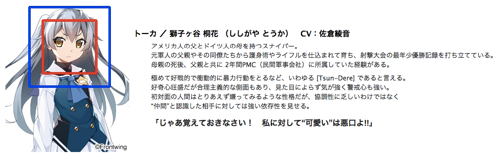
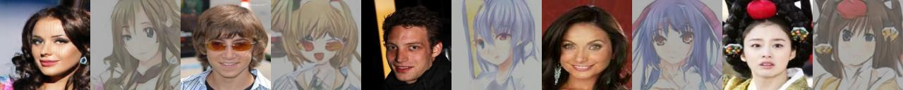
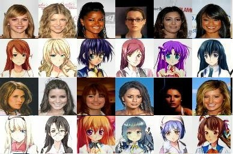
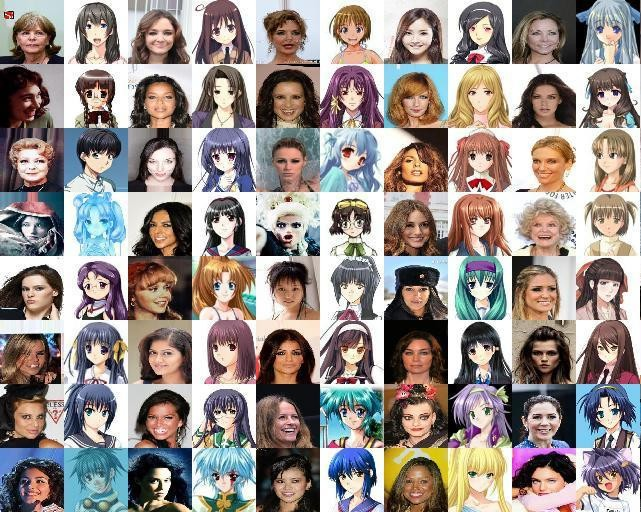
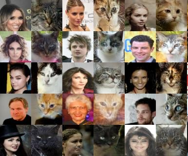
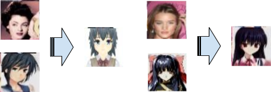
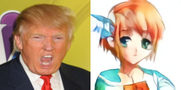

# TwinGAN -- Cross-Domain Translation of Human Portraits

*Author: Jerry Li*

## Introduction

Ever since I started watching anime, there is one thing that kept bothering me: I just cannot draw. After numerous attempts that ended up destroying my favorite characters, I gave up... Until I started doing machine learning (AI save me). Nowadays AI can play "go", drive, write poems that no one understands, that it seems possible to lend it a paintbrush and hopefully it will do something. **How to turn all human portraits into anime characters using AI?** That became my latest project.

In fact there are numerous attempts at teaching AI how to draw. I introduced two of them in the past: **Neural Style Transfer** and sketch colorization using **Generative Adversarial Networks(GAN)**, both of which are closely related to our project.

## Neural Style Transfer

 

*Latest Style Transfer result from [Deep Painterly Harmonization][Deep Painterly Harmonization]*

Simply put, style transfer is where one apply the style of one image onto another. The style can include brush strokes, color choice, lights and shadows, and object ratios etc. After Gatys invented a style transfer method using neural networks in 2015, there has been an issue that bring some researchers nightmares. 

Neural style transfer requires a pre-trained object detection network and most such networks are trained on **real life** objects. Thus when it comes to styles that give real life objects a rather different look -- such as elongated legs, huge eyes, and pretty much anything else you can get from an anime image -- neural style does not work that well. 

One straightforward solution is: **money**. Get some labelers to label all the noses, mouths, eyes, and whatever you have in an artwork specific dataset and retrain the object detection network. None has signed up for this tedious task so far, therefore I'm stuck.

## GAN

If style transfer is one way towards the anime world, then the other path is Generative Adversarial Network, aka [GAN][Generative Adversarial Nets]. Back in 2014, the famous Ian Goodfellow came up with [GAN][Generative Adversarial Nets], a pair of **competing neural network** that can mimic any data given enough samples, a good enough network, and enough time for training. Some recently famous applications include [MakeGirlsMoe](https://make.girls.moe/#/) (which literally does what the title says), and [PGGAN](https://arxiv.org/pdf/1710.10196.pdf) published by Nvidia that can generate incredibly realistic human portraits.

*Realistic human faces generated by [PGGAN][PGGAN]*

After years of improvement, recent GAN models can generate pretty high quality images, and it doesn't stop there. **GAN is also capable of "translating" one type of images into another**. By the end of 2016, A model called [pix2pix](https://arxiv.org/abs/1611.07004) is invented by Phillip Isola et. al. from Berkeley. Given a pair of images from two different domains(eg. maps and satellite images), pix2pix is able to translate from one to the other. In the mean time, Taizan Yonetsuji from Preferred Networks introduced [PaintsChainer](https://zhuanlan.zhihu.com/p/24712438), a UNet-based GAN model that automatically colorizes anime sketches. Both are perfect for our Human portrait project. However both requires **paired data** (one image from each domain). Due to cost, no one has published paired dataset on human and anime portraits.

*Taken from [pix2pix][pix2pix]*

## Unpaired Cross-Domain GAN

When it comes to unpaired data, the level of difficulty is completely different. Imagine learning a new language with no dictionary. It's like that.

Luckily it seems like I'm not the only researcher bogged down by high cost of paired data. At 2016, Facebook published a paper named [Unsupervised Cross-Domain Image Generation][Unsupervised Cross-Domain Image Generation] that illustrated how to translate two type of images, with one type having labels, without paired data. Soon afterwards in 2017, Jun-Yan Zhu et.al. introduced a similar model called [CycleGan][CycleGan], which works on **unlabeled unpaired datasets**. 

One of their big commonality is that, in order to tackle the problem of unpaired dataset, both model made the following assumption: When translating image type A to image type B, and transate B back to A, the resulting image after two translations should not be too different from the original input image. Using an example from translation, if you translate English to Spanish and back to English, the sentence you end up shouldn't be too different from what you have started with. The difference between the two is called the **cycle consistency loss** that can be used for training an image translation model like CycleGAN.

*Taken from [Unsupervised Cross-Domain Image Generation][Unsupervised Cross-Domain Image Generation]*

## Trying CycleGAN

The good news is that CycleGAN has open source code. After cloning the git repo, I started collecting training data. I took 200k images from CelebA as my human portraits. I then used the method mentioned in [MakeGirlsMoe][MakeGirlsMoe]'s technical report and scraped around 30k anime figures from a website called Getchu.

*Sample image from [Getchu](http://www.getchu.com/soft.phtml?id=933144) (Ayaneruuu!)*

After two days of training, the result looks like this:

It looks ok, but something doesn't seem right... It turns out that CycleGAN has its limitations. Because it is minimizing the cycle consistency loss, the network is **forced to find a one-to-one mapping** for all information from the input to the target domain. However, real and anime images sometimes do not have a one-to-one mapping. People don't have hair or eyes with all kinds of colors for example, and in real life the face is much more detailed than in anime. When doing image translation between the two, it is unreasonable to ask the network to find a one-to-one mapping because there probably is no such mapping. Forcing such loss on a network will probably not yield good results. 

The question is: without labeled data, how to find the matching parts from the two domains while innovate a little on the rest?

## Try Again! But from a Different Perspective

Fortunately, when existing GAN methods do not work, we can still look for some inspirations from Style Transfer. Early in 2016, Vincent Dumoulin from Google Brain has found that, by only learning two variables in Batch Normalization, they are able to use the same network to output images with a wide range of styles. They can even mix and match the style by mixing those parameters. Their paper [A Learned Representation For Artistic Style][A Learned Representation For Artistic Style] shows that Batch Normalization, a method originally invented to stablize neural network training, had even more potential than imagined.

Inspired by the methods mentioned above, I named my network Twin-GAN and finalized its structure as such:

### Twin-GAN - Technical Details
 
I used [PGGAN](https://arxiv.org/pdf/1710.10196.pdf) -- the current state of the art in image generation -- as my generator. Since PGGAN takes a high dimensional vector as its input and our input is an image, I used an encoder with structure symmetric to PGGAN to encode the image into the high dimensional vector.
 
Furthermore, in order to keep the details of the input image, I used the UNet structure to connect the convolutional layers in the encoder with the corresponding layers in the generator. The input and output falls into the following three categories:

1. Human Portrait->Encoder->High Dimensional Vector->PGGAN Generator + human-specific-batch-norm->Human Portrait
2. Anime Portrait->Encoder->High Dimensional Vector->PGGAN Generator + anime-specific-batch-norm->Anime Portrait
3. Human Portrait->Encoder->High Dimensional Vector->PGGAN Generator + anime-specific-batch-norm->Anime Portrait

As mentioned in [the Facebook paper][Unsupervised Cross-Domain Image Generation], letting the human and anime portraits share the same network will help the network realize that: although they look a little bit different, both human and anime portraits are describing a face. This is crucial to image translation. The switch that decides whether to output human or anime portrait lies in the batch norm parameters.

Regarding the loss function, I used the following four losses:

1. Human portrait reconstruction loss.
2. Anime portrait reconstruction loss.
3. Human to anime GAN loss.
4. Human to anime cycle consistency loss.

## Result

After training, the result is as follows:

Not bad, right? 

And Twin-GAN can do more than that. Because Anime and real human portraits share the same latent embedding, we can extract that embedding and do nearest neighbor search in both domains. That is, given an image we can find who looks the closest in both real and anime images!

Most of them look pretty accurate. From here we can peak into the thoughts of a neural network. In its understanding, the blonde hair girls should still be blonde if they live in the anime world, but brown hair was far too common in the real world so it decided to innovate a little bit and dye everyone's hair in all kinds of colors.  Some expressions and hair styles can find their correspondance in their nearest neighbors in the anime world. However, notice the woman  towards the middle right wearing a Russian winter hat -- that hat does not exist in our anime training set. Our trained network again gets a little creative and just think of it as another hair accessory. 

The downsides of our network is also pretty obvious from this image. Sometimes it mistaken the background for the hair color, and other times it maps people into facing the opposite directions. Those kinds of error cases can also be seen in the transferred images during training.

Actually, our network can be applied to a lot of other tasks. For example, what happens if I train it on cat images?

Nya! This is fun. However, a lot of times, I might not be so satisfied with the image translation result. For example, if the input image has brown hair and I just want the output to have bright green hair. The model does not support direct modification of such features. I used [illust2vec][illust2vec] to extract character features such as hair color, eye color, etc. Then I got some ideas from [Conditional generative adversarial nets][Conditional generative adversarial nets] and supplied those features as embeddings to Generator. Now when I generate an image, I add an additional Anime character as input, and the transferred result should look like that character, with the position and facial expression(TODO) of the human portrait kept untouched. The result is like this:

The result is not perfect yet. But I can spend some more time improving it in the future. The most important thing is: I have an awesome AI that can **turn a human portrait into a cat face, an original anime character or any character given by the user**, so I don't have to learn painting anymore.

## P.S.

One of the biggest problem of the current algorithm still lies in the dataset. For example, the anime faces I collected are mostly female characters. The neural network is prone to translating male characters into female ones because it sees female more often. It also can mistaken the background color for hair color, ignore important features and/or mis-recognize them. A failure case is shown below:

But in addition to improving the network, there are still a lot more new tasks to be done. For example how to expand the algorithm to generate more than human faces. How to dynamically change the output using more detailed human hints? Or how to adapt this algorithm on videos? These are all important yet un-answered questions.

Two more thing worth mentioning is: a few months ago Shuang Ma proposed a network named [DA-GAN][DA-GAN] that uses attention map to do image translation and also got some good results. And just **yesterday**(2018/4/15), Nvidia [disclosed a framework](https://blogs.nvidia.com/blog/2018/04/15/nvidia-research-image-translation/) that transforms cats into dogs. Both made me look forward to more exciting future developments in this area.

The related paper and website may be updated in the future. Please see my English [blog](https://jerrylijiaming.com/)(under construction)  or [Zhihu](https://www.zhihu.com/people/li-jia-ming-47-5/activities) for more updates. Thanks for reading!

P.P.S Some arguments in the paper are overly simplified for easier understanding. Please read the citations below if you're interested in the technical details.

中文版链接

## Citations

[A Neural Algorithm of Artistic Style][A Neural Algorithm of Artistic Style]

[MakeGirlsMoe][MakeGirlsMoe]

[PGGAN][PGGAN]

[CycleGAN][CycleGAN]

[pix2pix][pix2pix]

[A Learned Representation For Artistic Style][A Learned Representation For Artistic Style]

[Unsupervised Cross-Domain Image Generation][Unsupervised Cross-Domain Image Generation]

[DA-GAN][DA-GAN]

[Spectral Normalization for Generative Adversarial Networks][Spectral Normalization for Generative Adversarial Networks]

[Conditional generative adversarial nets][Conditional generative adversarial nets]

[illust2vec][illust2vec]

[Deep Painterly Harmonization][Deep Painterly Harmonization]

[Generative Adversarial Nets][Generative Adversarial Nets]

[Multimodal Unsupervised Image-to-Image Translation][Multimodal Unsupervised Image-to-Image Translation]

[A Neural Algorithm of Artistic Style]: https://arxiv.org/pdf/1508.06576.pdf
[MakeGirlsMoe]: https://makegirlsmoe.github.io/main/2017/08/14/news-english.html
[PGGAN]: https://arxiv.org/pdf/1710.10196.pdf
[CycleGAN]: https://junyanz.github.io/CycleGAN/
[pix2pix]: https://github.com/phillipi/pix2pix
[A Learned Representation For Artistic Style]: https://arxiv.org/abs/1610.07629
[Unsupervised Cross-Domain Image Generation]: https://arxiv.org/pdf/1611.02200.pdf
[DA-GAN]: https://arxiv.org/abs/1802.06454
[Spectral Normalization for Generative Adversarial Networks]: https://arxiv.org/abs/1802.05957
[Conditional generative adversarial nets]: https://arxiv.org/pdf/1411.1784.pdf
[illust2vec]: https://github.com/rezoo/illustration2vec
[Deep Painterly Harmonization]: https://arxiv.org/abs/1804.03189
[Generative Adversarial Nets]: http://papers.nips.cc/paper/5423-generative-adversarial-nets
[Multimodal Unsupervised Image-to-Image Translation]: https://arxiv.org/abs/1804.04732