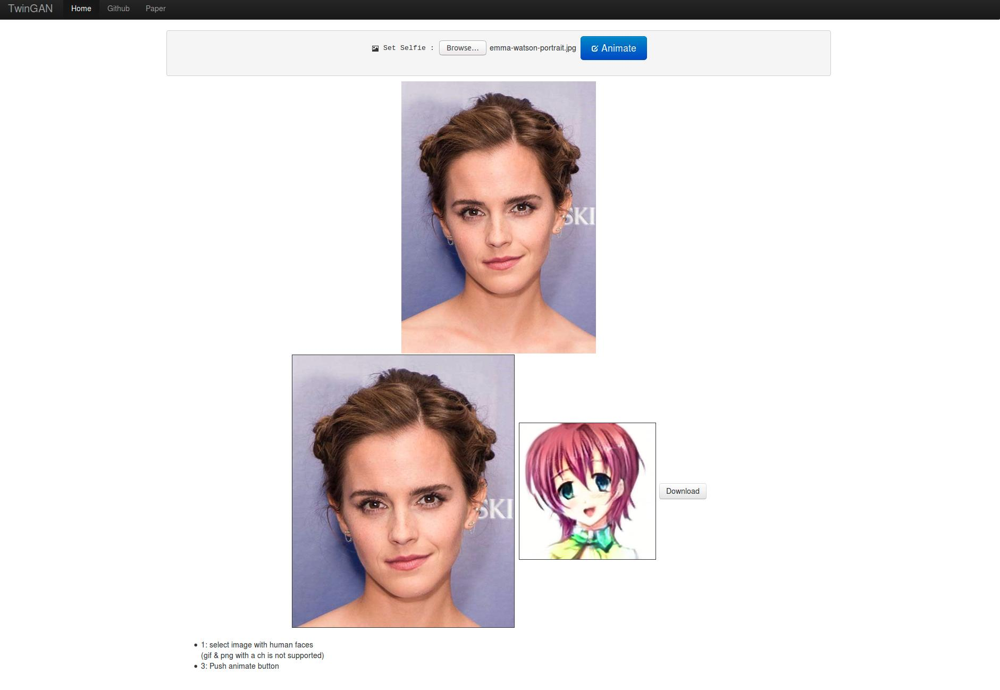

# Web Interface

## Setup

First, download and extract the frozen graph of the pretrained model [here](https://drive.google.com/open?id=1C1tadCQjzsiW2GBeL8BbgfyKXKsoQCjJ).

To support multiple asynchronous requests, we use [TensorFlow Serving](https://www.tensorflow.org/serving/), which you can [setup following this guide](https://www.tensorflow.org/serving/setup). 

Install other dependencies
```shell
pip install grpcio
```

## Usage

```shell
# Start tensorflow model server
tensorflow_model_server --port=9000 --model_name=test --model_base_path=/PATH/TO/MODEL/export/

# Start http server.
cd /PATH/TO/TwinGAN/interface
python /home/jerryli27/PycharmProjects/TwinGAN/interface/server.py
--twingan_server=localhost:9000
--image_hw=256
--gpu=1

# Visit webpage
http://localhost:8000/static/
```

Your webpage should look something like this:



## Interface with Waifu2x

For those who wants larger images, We provide code to connect with [Waifu2x](https://github.com/nagadomi/waifu2x) to upscale generated images. After you install Waifu2x, simply run the following command to start its web interface.

```shell
# Follow https://github.com/nagadomi/waifu2x#installation to install
cd PATH/TO/waifu2x
th web.lua

# Optionally, use the following to restrict it to gpu0 if you have multiple.
# CUDA_VISIBLE_DEVICES=0 th web.lua
```

After that, start the server as usual and change your url to add `do_waifu2x=true`. For example: `http://localhost:8000/static/?do_waifu2x=true`


## Use your own model

To use the model you trained, you would need the exported frozen graph, which you can get by setting the flag `do_export=true`

e.g.

```shell
python pggan_runner.py
--program_name=twingan
--dataset_name="image_only"
# ... All the flags are the same as your training script
#     except for the ones below
--is_training=False
--do_export=True
--export_path="/PATH/TO/CHECKPOINT/export/"
```

## Common questions


#### TensorFlow Serving is hard to use. Why bother?

If you find it hard to use/install and you don't care about utilizing your GPU 100%, it should be easy to adapt [the inference code](inference/image_translation_infer.py) for this purpose. Contributions and pull requests are more than welcome.

#### Results are awful

The pretrained model works well only when the faces takes up a major portion of the image. We use a light weight face detector to do the cropping, but when that fails to detect any faces, we use the whole image instead as the fallback. 

